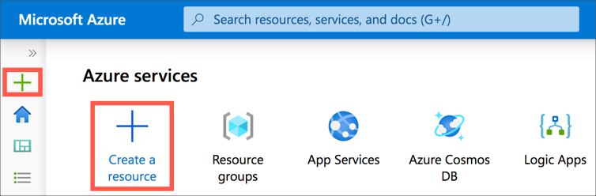
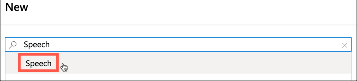
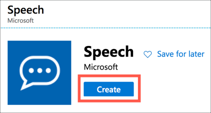
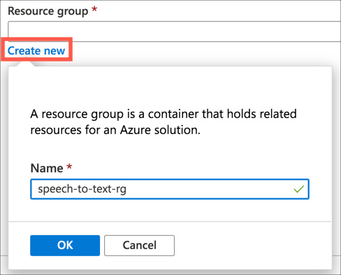
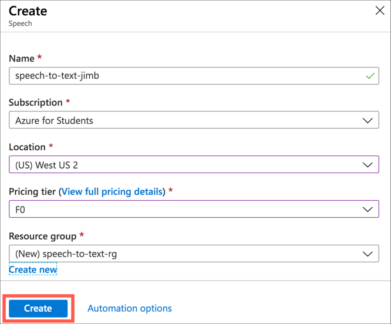
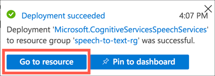
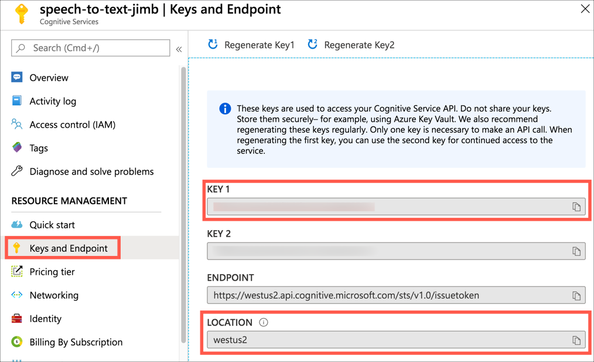

# Speech To Text Samples

This repo contains a number of code samples showing how to use the [Azure Speech to Text service](https://azure.microsoft.com/services/cognitive-services/speech-to-text/?WT.mc_id=build2020_ca-github-jabenn) from Python. This service is part of a suite of pre-built AI services you can use to add intelligence to your apps in only a few lines of code. These services are known as [Azure Cognitive Services](https://azure.microsoft.com/services/cognitive-services/?WT.mc_id=build2020_ca-github-jabenn).


To use these samples, you will need an Azure subscription, and an Azure Speech to Text resource.

## Create an Azure subscription

To use Azure services you will need an Azure subscription. If you don't have a subscription you can sign up for free.

* If you are a student aged 18 and up and have an email address from an academic institution, you can sign up for the free Azure for Students offer at [azure.microsoft.com/free/students](https://azure.microsoft.com/free/students/?WT.mc_id=build2020_ca-github-jabenn) without a credit card. At the time of writing this gives you $100 of credit to use over 12 months, as well as free tiers of a number of services for that 12 months. At the end of the 12 months, if you are still a student you can renew and get another $100 in credit and 12 months of free services.

* If you are not a student, you can sign up at [azure.microsoft.com/free](https://azure.microsoft.com/free/?WT.mc_id=build2020_ca-github-jabenn). You will need a credit card for verification purposes only, you will not be billed unless you decide to upgrade your account to a paid offering. At the time of writing the free account will give you US$200 of free credit to spend on what you like in the first 30 days, 12 months of free services, plus a load of services that have tiers that are always free.

## Create the Speech to Text resource

To use the [Azure Speech to Text service](https://azure.microsoft.com/services/cognitive-services/speech-to-text/?WT.mc_id=build2020_ca-github-jabenn), you will need to create a resource in your Azure subscription.

The speech to text service has a number of tiers, providing different pricing, with a generous free tier. At the time of writing you can get 5 hours of audio converted from speech to text a month for free. You can only create one free tier per service per subscription.

> You can find the latest pricing details on the [Speech to Text pricing page](https://azure.microsoft.com/pricing/details/cognitive-services/speech-services/?WT.mc_id=build2020_ca-github-jabenn).

You can create this resource from the [Azure Portal](https://portal.azure.com/?WT.mc_id=build2020_ca-github-jabenn) or the [Azure CLI](https://docs.microsoft.com/cli/azure/?WT.mc_id=build2020_ca-github-jabenn).

### Create the resource using the Azure Portal

1. Launch the [Azure Portal](https://portal.azure.com?WT.mc_id=build2020_ca-github-jabenn)

1. Log in with the account you used to create your Azure subscription

1. Select **+ Create a resource** from the home screen or the side menu

    

1. Search for `Speech` and select **Speech** from the drop down

    

    > Make sure you select the resource called just *Speech*, as there are other speech related resources available on Azure.

1. Select **Create**

    

1. Fill in the details for the resource:

    * For the name, enter `speech-to-text` followed by the date or your name. Speech resources created through the portal need to have a globally unique name, so you will need something unique.

    * Select the subscription you want to use

    * Select the location closest to you. You can see the regions on a map on the [Azure Regions page](https://azure.microsoft.com/global-infrastructure/regions/?WT.mc_id=build2020_ca-github-jabenn).

    * Select the F0 pricing tier. This is the free tier

    * For the resource group, select the **Create new** option, and name the resource group `speech-to-text-rg`. Select **OK** to set the new resource group name.

        

1. Select **Create**

    

1. The resource will deploy, and you will get a notification when done. Select **Go to resource** from the notification.

    

1. From the resource blade, select *Resource Management -> Keys and Endpoint**

1. Make a note of the value of **Key 1** and **Location**

    

### Create the resource using the Azure CLI

1. If you don't have the Azure CLI installed, install it by following [these instructions on Microsoft Docs](https://docs.microsoft.com/cli/azure/install-azure-cli?WT.mc_id=build2020_ca-github-jabenn)

1. Sign in to the Azure CLI using the following command:

    ```sh
    az login
    ```

    This will launch a browser window where you can log in with the account you used to create your Azure subscription. Once you are logged in you can close the browser window.

1. If you have more than one Azure subscription (such as a student subscription and a University subscription), ensure you have the correct subscription set.

    1. Use the following command to list all your available subscriptions:

        ```sh
        az account list \
          --output table
        ````

    1. Set the active subscription using the following command:

        ```sh
        az account set
          --subscription <subscription_id>
        ```

        Set `<subscription_id>` to the appropriate value from the `SubscriptionId` column in the table output by the previous command.

1. Azure has multiple regions worldwide. When you create a resource, you select the region. You should select the one closest to you. To see all available regions for your subscription, use the following command:

    ```sh
    az account list-locations --output table
    ```

    Note the value from the `name` column for the location closest to you. You can see the regions on a map on the [Azure Regions page](https://azure.microsoft.com/global-infrastructure/regions/?WT.mc_id=build2020_ca-github-jabenn). Make a note of this location as you will need it to run the samples.

1. Create a resource group to contain your resource. Resource groups are logical groupings of resources that allow you to manage the resources together, for example deleting a resource group to delete all the resources that it contains. Use the following command to do this:

    ```sh
    az group create \
      --name speech-to-text-rg \
      --location <region>
    ```

    Replace `<region>` with the location closest to you.

    This will create a resource group called `speech-to-text-rg`.

1. Once the resource group has been created, create the Speech to Text resource. Do this using the following command:

    ```sh
    az cognitiveservices account create \
      --name speech-to-text \
      --resource-group speech-to-text-rg \
      --kind SpeechServices \
      --sku F0 \
      --yes \
      --location <region>
    ```

    Replace `<region>` with the location you used to create the resource group.

    This will create a Speech to Text resource called `speech-to-text` in the `speech-to-text-rg` resource group. This will use the free tier.

    > Unlike using the Azure Portal (above), speech resources created through the Azure CLI don't need a unique name, only unique per resource group.

1. To access this resource from code, you will need a key. You can list the keys using the following command:

    ```sh
    az cognitiveservices account keys list \
      --name speech-to-text \
      --resource-group speech-to-text-rg \
      --output table
    ```

    Take a note of the value from the `Key1` column as you will need it to run the samples.

## The samples

All these samples will need the location/region name and key for your Speech to Text service. Instructions on how to set up each sample are in the [Project Setup Instructions](./ProjectSetup.md).

* [Basic Speech To Text](./BasicSpeechToText) - a very basic example that listens to your microphone and converts whatever it hears into text which is output to the console.
* [Translation](./Translation) - a translation sample that listens to your microphone and outputs what it hears to the console in Chinese, English, French, and German.
* [Translation with speech](./TranslationWithSpeech) - a translation sample that listens to your microphone and outputs what it hears to the console in Chinese, English, French, and German, as well as playing an the Chinese version through your audio device.
* [UI Control](./UIControl) - a UI application controllable by speech. It has a label showing what you have just said. Say blue, green or black to change the color of the text.

## Learn more


* Learn more with hands-on, self guided learning using the [Process and translate speech with Azure Cognitive Speech Services](https://docs.microsoft.com/learn/paths/translate-speech-with-speech-services/?WT.mc_id=build2020_ca-github-jabenn) learning path on Microsoft Learn.
* Read more on the Python Speech Service SDK on [Microsoft Speech SDK docs](https://docs.microsoft.com/azure/cognitive-services/speech-service/?WT.mc_id=build2020_ca-github-jabenn).
