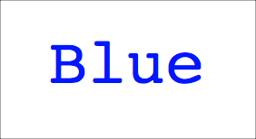

# UI control sample

This sample demonstrates using speech to control an app.

## Setup

Before you can run this sample, you will need to ensure you have your Python development environment set up, and do some setup on this project.

Follow the [Project Setup Instructions](../ProjectSetup.md) to get this project set up, including the environment variables, virtual environment and pip packages.

## Run the code

1. From the Visual Studio Code terminal, run the following command:

    ```sh
    python app.py
    ```

The app will launch a UI using Tkinter. Speak into your default microphone in English and you will see the words you have said output to the UI in English. Say `blue` to change the label text color to blue, `green` to change it to green, and `black` to change it to black. Say `stop` to end the program. Look through the code to see if you can find an extra command!



## Change the detected language

This app is configured to listen for words spoken in English, and output the English text of the spoken words. This configuration is set on line 113:

```python
speech_config = speechsdk.SpeechConfig(subscription=key, 
                                       region=region, 
                                       speech_recognition_language='en-GB')
```

To change the recognized language, change the value of `'en-GB'` to a different language identifier, such as `'en-US'` for American English, or `'zh-CN'` for Chinese. You can find the list of supported languages in the [Language and voice support for the Speech service docs](https://docs.microsoft.com/azure/cognitive-services/speech-service/language-support?WT.mc_id=build2020_ca-github-jabenn) on Microsoft Docs.
